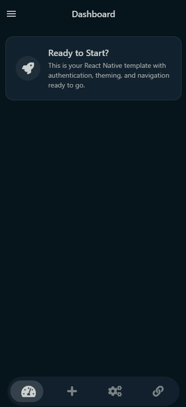
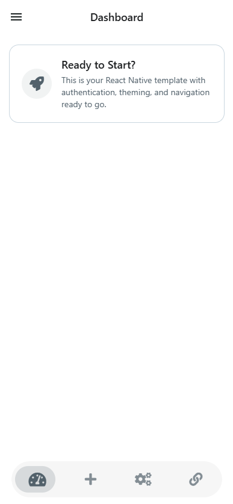

# React Native Template

A production-ready React Native template with authentication, theming, navigation, and persistent storage.

## 🚀 Features

- ✅ **Authentication System** - Login/logout with AsyncStorage persistence
- ✅ **Theme System** - Light/dark mode with persistent user preference
- ✅ **Navigation** - Drawer + Tab navigation with Expo Router
- ✅ **Onboarding** - First-time user experience
- ✅ **Bottom Sheet** - Configurable bottom sheet provider
- ✅ **TypeScript** - Full TypeScript support
- ✅ **AsyncStorage** - Persistent data storage
- ✅ **Clean Architecture** - Well-organized folder structure

## 📱 Screenshots

<div align="center">

### 🌙 Dark Theme


### ☀️ Light Theme  


</div>

### ✨ What You See:
- **🎨 Adaptive Theming** - Seamless dark/light mode switching
- **🧭 Clean Navigation** - Drawer menu with intuitive icons
- **📊 Dashboard Layout** - Minimal, professional design
- **🚀 Welcome Card** - Engaging user onboarding
- **📱 Tab Navigation** - Bottom tabs for easy access
- **🎯 Template Ready** - Perfect starting point for any app

*The template automatically adapts to your device's theme preference and remembers your choice using AsyncStorage.*

## 🛠 Quick Start

### Prerequisites

- Node.js (v16 or higher)
- npm or yarn
- Expo CLI
- React Native development environment

### Installation

1. **Use this template:**
   ```bash
   # If this is a GitHub template
   npx create-expo-app MyApp --template https://github.com/DishanH/react-native-template
   
   # Or clone directly
   git clone https://github.com/DishanH/react-native-template.git MyApp
   cd MyApp
   ```

2. **Install dependencies:**
   ```bash
   npm install
   ```

3. **Start the development server:**
   ```bash
   npm start
   ```

4. **Customize for your project:**
   - Update `app.json` with your app name and details
   - Modify colors in `app/theme/colors.ts`
   - Update the welcome message in `app/tabs/index.tsx`
   - Replace placeholder content with your app's content

## 📁 Project Structure

```
app/
├── components/          # Reusable components
│   ├── BottomSheetProvider.tsx
│   ├── ThemeToggle.tsx
│   └── ...
├── tabs/               # Tab navigation screens
│   ├── index.tsx       # Dashboard
│   └── _layout.tsx     # Tab layout
├── theme/              # Theme configuration
│   ├── colors.ts       # Color definitions
│   ├── ThemeContext.tsx
│   └── types.ts
├── utils/              # Utility functions
│   ├── authContext.tsx # Authentication logic
│   └── storage.ts      # AsyncStorage utilities
├── login.tsx           # Login screen
├── onboarding/         # Onboarding flow
├── settings.tsx        # Settings screen
├── groups.tsx          # Groups screen
├── activity.tsx        # Activity screen
└── _layout.tsx         # Root layout
```

## 🎨 Customization

### Colors & Theming

Edit `app/theme/colors.ts` to customize your app's color scheme:

```typescript
const LIGHT_PALETTE = {
  darkest: '#1E2022',
  darker: '#52616B',
  medium: '#C9D6DF',
  light: '#F0F5F9',
  lightAlt: '#FFFFFF'
};
```

### Authentication

The template includes a complete authentication system with:
- Login/logout functionality
- Persistent login state
- Protected routes
- Auth context provider

### Navigation

Built with Expo Router featuring:
- Drawer navigation
- Tab navigation
- Nested routing
- Type-safe navigation

### Storage

AsyncStorage utilities for:
- Authentication state
- Theme preferences
- Onboarding status
- User data

## 📦 Dependencies

### Core Dependencies
- `expo` - Expo framework
- `expo-router` - File-based routing
- `react-native` - React Native framework
- `@react-native-async-storage/async-storage` - Persistent storage

### UI & Navigation
- `@react-navigation/drawer` - Drawer navigation
- `@expo/vector-icons` - Icon library
- `@gorhom/bottom-sheet` - Bottom sheet component

### Development
- `typescript` - TypeScript support
- `@types/*` - Type definitions

## 🔧 Scripts

```bash
npm start          # Start Expo development server
npm run android    # Run on Android
npm run ios        # Run on iOS
npm run web        # Run on web
```

## 🛠 Troubleshooting

### Metro Error: "module is not defined"

If you encounter this error when starting the project:

```bash
Metro error: node_modules\expo-router\node\render.js: module is not defined
```

**Solution:**
1. Make sure `package.json` does NOT have `"type": "module"`
2. Clear Metro cache: `npx expo start --clear`
3. Reinstall dependencies: `rm -rf node_modules && npm install`

### Common Issues:

**Node Modules Issues:**
```bash
# Clear everything and reinstall
rm -rf node_modules package-lock.json
npm install
```

**Metro Cache Issues:**
```bash
# Clear Metro cache
npx expo start --clear
```

**TypeScript Errors:**
```bash
# Check TypeScript configuration
npx tsc --noEmit
```

## 📝 Usage Tips

### Adding New Screens

1. Create a new file in the `app/` directory
2. Export a React component as default
3. The file will automatically become a route

### Modifying Theme

1. Update colors in `app/theme/colors.ts`
2. Theme changes apply automatically across the app
3. Users can toggle between light/dark modes

### Adding Authentication Logic

1. Modify `app/utils/authContext.tsx`
2. Update login/logout functions
3. Add your API endpoints

### Customizing Onboarding

1. Edit `app/onboarding/index.tsx`
2. Update slides and content
3. Modify completion logic

## 🚀 Deployment

### Building for Production

```bash
# Build for Android
npx expo build:android

# Build for iOS
npx expo build:ios

# Build for web
npx expo export:web
```

### Environment Setup

1. Configure your `app.json`
2. Set up environment variables
3. Configure build settings

## 🤝 Contributing

1. Fork the repository
2. Create a feature branch
3. Make your changes
4. Submit a pull request

## 📄 License

This project is licensed under the MIT License - see the [LICENSE](LICENSE) file for details.

## 🙏 Acknowledgments

- Expo team for the amazing framework
- React Navigation for navigation solutions
- Community contributors

## 📞 Support

If you have any questions or need help:
- Open an issue on GitHub
- Check the documentation
- Join our community discussions

---

**Happy coding! 🎉**

> This template is designed to give you a head start on your React Native projects. Customize it to fit your needs and build amazing apps!
